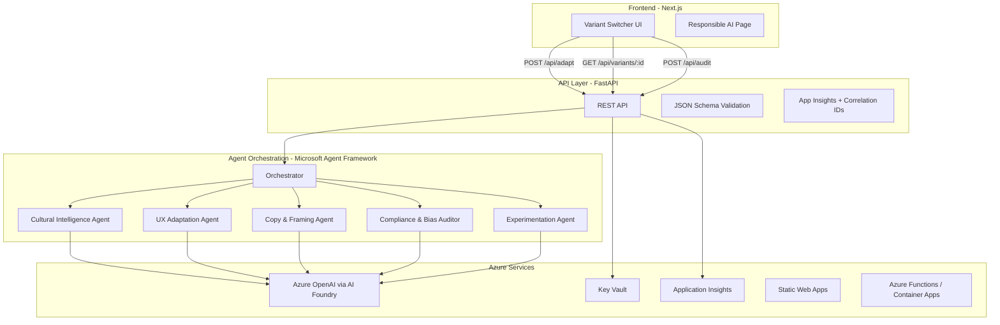

# 🌍 CultureBridge AI

> **Adapt e-commerce experiences by cultural behavior — not just language.**

[](https://github.com/YOUR_ORG/culturebridge-ai/actions/workflows/ci.yml)
[](https://github.com/YOUR_ORG/culturebridge-ai/actions/workflows/deploy.yml)
[](LICENSE)

---

## 🎯 The Problem

International e-commerce loses **20-40% conversion** when expanding into new markets — not because of language barriers, but due to **culturally misaligned decision flows and trust signals**. 

A checkout flow optimized for Germany (explicit specs, structured process) fails in Guatemala (relationship-first, flexible payments) and Japan (consensus cues, uncertainty reduction).

**CultureBridge AI** uses multi-agent AI orchestration to analyze cultural behavioral dimensions and generate region-adapted storefront variants with **explainable predicted conversion lift**.

---

## ✨ Key Features

- 🧠 **Multi-Agent Architecture** — Five specialized AI agents working in orchestration
- 🌐 **Dimension-Driven Adaptation** — Cultural intelligence based on behavioral research, not stereotypes
- 🔍 **Bias Auditing** — Built-in compliance and fairness validation
- 📊 **Explainable AI** — Every recommendation includes transparent rationale
- ☁️ **Azure-Native** — Production-ready deployment with enterprise security
- 🚀 **Real-Time Generation** — Adaptive variants in seconds

---

## 🏗️ Architecture


📖 **[View detailed architecture →](docs/architecture.md)**

---

## 🧠 How It Works

### Multi-Agent Orchestration

Each agent is a specialized AI component with a distinct responsibility:

| Agent | Role | Input | Output |
|-------|------|-------|--------|
| **Cultural Intelligence** | Analyze behavioral dimensions for target region | Country code + product category | `CulturalBehaviorProfile` with scored dimensions |
| **UX Adaptation** | Adapt checkout flow, modules, layout emphasis | Cultural profile + base storefront spec | Flow steps, module placement, validation rules |
| **Copy & Framing** | Reframe CTAs, microcopy, value propositions | Cultural profile + UX adaptations | Copy variants with behavioral rationale |
| **Compliance & Bias Auditor** | Check for stereotyping, require dimension-based justification | All agent outputs | Audit score, risk flags, recommended changes |
| **Experimentation** | Generate predicted lift model + A/B test plan | Complete variant spec | Predicted conversion lift with transparent assumptions |

Every agent returns **structured JSON with a `rationale` field** explaining its reasoning — ensuring transparency and auditability.

### Cultural Model (Explainable)

We use a **dimension-driven approach** based on behavioral research, not stereotypes:

| Dimension | Effect on UX |
|-----------|-------------|
| **Uncertainty Avoidance** | Higher scores → more trust modules, clearer shipping/returns policies, fewer surprises |
| **Context Level** | Lower scores → explicit specs and pricing details shown earlier in the flow |
| **Collectivism** | Higher scores → stronger social proof (reviews, community endorsements, testimonials) |
| **Friction Tolerance** | Lower scores → fewer checkout steps, autofill, minimal form fields |
| **Trust Need** | Higher scores → guarantees, certifications, authority signals placed prominently |
| **Price Sensitivity** | Higher scores → value framing, comparison tools, installment payment options |

📖 **[Read full cultural model documentation →](docs/cultural-model.md)**

---

## 🚀 Quick Start

### Prerequisites

- **Node.js** 18+ & **pnpm** 8+
- **Python** 3.11+
- **Azure CLI** (for deployment)
- **Azure OpenAI** resource (or AI Foundry endpoint)

### 1. Clone the Repository
```bash
git clone https://github.com/YOUR_ORG/culturebridge-ai.git
cd culturebridge-ai
```

### 2. Configure Environment
```bash
cp .env.example .env
```

Edit `.env` with your Azure credentials:
```env
AZURE_OPENAI_ENDPOINT=https://your-resource.openai.azure.com/
AZURE_OPENAI_API_KEY=your-key
AZURE_OPENAI_DEPLOYMENT=gpt-4o
AZURE_OPENAI_API_VERSION=2024-10-21
APPLICATIONINSIGHTS_CONNECTION_STRING=your-connection-string
```

### 3. Install Dependencies
```bash
# Frontend
pnpm install

# Backend
cd apps/api
pip install -r requirements.txt
```

### 4. Run Development Servers
```bash
# Terminal 1 - Frontend (port 3000)
pnpm dev

# Terminal 2 - Backend (port 8000)
cd apps/api
uvicorn main:app --reload --port 8000
```

**Or use Docker Compose:**
```bash
docker-compose up --build
```

### 5. Access the Application

- **Frontend:** http://localhost:3000
- **API Docs:** http://localhost:8000/docs

### 6. Run Tests
```bash
cd apps/api
python -m pytest tests/ -v
```

---

## 📦 API Reference

### Generate Adapted Variant
```http
POST /api/adapt
Content-Type: application/json
```

**Request Body:**
```json
{
  "country_code": "JP",
  "product_category": "electronics",
  "price_band": "mid",
  "audience": "general_consumer",
  "override_dimensions": {
    "uncertainty_avoidance": 85
  }
}
```

**Response:**
```json
{
  "variant_id": "var_abc123",
  "cultural_profile": { /* ... */ },
  "ux_adaptations": { /* ... */ },
  "copy_variants": { /* ... */ },
  "predicted_lift": 0.23,
  "audit_score": 0.92
}
```

### Retrieve Variant
```http
GET /api/variants/{variant_id}
```

### Audit Variant
```http
POST /api/audit
Content-Type: application/json
```

**Request Body:**
```json
{
  "variant_id": "var_abc123"
}
```

📖 **[Full API documentation →](docs/api-reference.md)**

---

## ☁️ Azure Deployment

### Option 1: One-Click Deploy
```bash
# Login to Azure
az login

# Deploy infrastructure
cd infra/bicep
az deployment group create \
  --resource-group culturebridge-rg \
  --template-file main.bicep \
  --parameters @parameters.json

# Deploy application via GitHub Actions
git push origin main
```

### Option 2: GitHub Actions CI/CD

Push to `main` branch to trigger automated deployment. The workflow:

1. Builds frontend and API containers
2. Runs tests and security scans
3. Deploys to Azure Static Web Apps + Functions/Container Apps
4. Updates Application Insights configuration

### Infrastructure Components

| Resource | Purpose | Config |
|----------|---------|--------|
| **Azure OpenAI** | LLM inference via AI Foundry | GPT-4o deployment |
| **Azure Functions** | Serverless API hosting | Python 3.11 runtime |
| **Static Web Apps** | Next.js frontend hosting | CDN + custom domains |
| **Key Vault** | Secrets management | Managed identity access |
| **Application Insights** | Observability + distributed tracing | Correlation IDs enabled |

🔒 **[View threat model & security →](docs/threat-model.md)**

---

## 🎬 2-Minute Demo Script

| Time | Action | What to Show |
|------|--------|--------------|
| **0:00–0:20** | Introduce the problem | Same storefront → different regions → conversion drop |
| **0:20–1:10** | Generate variants | Select product → generate JP/GT/DE variants → side-by-side comparison UI |
| **1:10–1:35** | Show compliance audit | Audit score, risk flags, dimension-based justifications |
| **1:35–1:55** | Show Azure integration | Deployment architecture + App Insights trace correlation |
| **1:55–2:00** | Conclusion | Predicted lift summary + enterprise readiness highlights |

📖 **[Full demo script with screenshots →](docs/demo-script.md)**

---

## 🤖 Built with GitHub Copilot

This project leveraged **GitHub Copilot Agent Mode** in VS Code to accelerate development:

### What Copilot Helped With

1. **Schema Generation** — Generated initial JSON Schema definitions from TypeScript interfaces
2. **Agent Prompt Engineering** — Suggested system prompt structures for each specialized agent
3. **Infrastructure as Code** — Generated base Bicep templates for Azure resources
4. **Test Scaffolding** — Created test cases for cultural dimension mapping and bias detection
5. **API Boilerplate** — Accelerated FastAPI route handlers and middleware
6. **UI Components** — Assisted with React component structure and Tailwind styling

### Human Review Process

All AI-generated code was reviewed for:
- ✅ Correctness and domain accuracy
- ✅ Security best practices
- ✅ Bias and fairness concerns
- ✅ Accessibility compliance

> **Copilot was used as an accelerator, not a replacement for domain expertise.**

---

## 🤝 Contributing

We welcome contributions! Please see our [Contributing Guide](CONTRIBUTING.md) for details.

### Development Workflow

1. Fork the repository
2. Create a feature branch (`git checkout -b feature/amazing-feature`)
3. Make your changes and add tests
4. Run tests and linting (`pnpm test`, `pnpm lint`)
5. Commit with conventional commits (`feat:`, `fix:`, `docs:`)
6. Push and create a Pull Request

---

## 👥 Team

| Name | Role | GitHub |
|------|------|--------|
| Joshua Rosales | Full-Stack Lead | [@handle] |
| Jonathan | AI/ML Engineer | [@handle] |
| Jose Medina | UX/Frontend | [@handle] |

---

## 📚 Documentation

- [Architecture Overview](docs/architecture.md)
- [Cultural Model & Dimensions](docs/cultural-model.md)
- [Responsible AI Statement](docs/responsible-ai.md)
- [API Reference](docs/api-reference.md)
- [Threat Model & Security](docs/threat-model.md)
- [Demo Script](docs/demo-script.md)
- [Deployment Guide](docs/deployment.md)

---

## 📄 License

This project is licensed under the MIT License — see the [LICENSE](LICENSE) file for details.

---

## 🙏 Acknowledgments

- Built with [Microsoft Agent Framework](https://github.com/microsoft/semantic-kernel)
- Powered by [Azure OpenAI Service](https://azure.microsoft.com/en-us/products/ai-services/openai-service)
- Cultural dimensions research based on Hofstede, Hall, and Meyer frameworks

---

<p align="center">
  <strong>Made with ❤️ for global commerce</strong>
</p>

<p align="center">
  <a href="#-the-problem">Problem</a> •
  <a href="#-how-it-works">How It Works</a> •
  <a href="#-quick-start">Quick Start</a> •
  <a href="#-azure-deployment">Deploy</a> •
  <a href="#-documentation">Docs</a>
</p>
