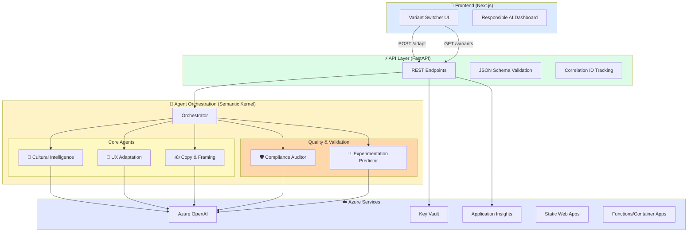
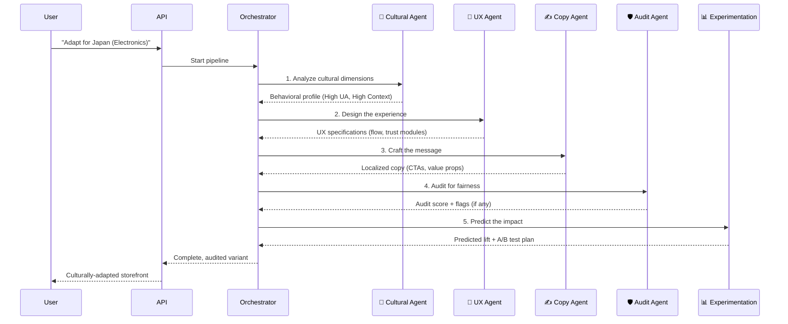

<div align="center">

# 🌍 CultureBridge AI

### *Adapt e-commerce by cultural behavior — not just language*

[](https://github.com/YOUR_ORG/culturebridge-ai/actions/workflows/ci.yml)
[](https://github.com/YOUR_ORG/culturebridge-ai/actions/workflows/deploy.yml)
[](LICENSE)
[](https://azure.microsoft.com)

---

**[📖 Docs](docs/)** • **[🚀 Quick Start](#-quick-start)** • **[☁️ Deploy](#%EF%B8%8F-azure-deployment)** • **[🎬 Demo](#-demo)** • **[🤝 Contribute](CONTRIBUTING.md)**

</div>

---

## 💡 The $1 Trillion Cultural Disconnect

<table>
<tr>
<td width="50%">

### 📉 The Global E-commerce Paradox

Expanding internationally, you expect a **20-40% drop in conversions**. But why?

It's not the language. It's the **experience**. A checkout flow that works perfectly in Berlin can feel rigid and untrustworthy in Guatemala City. You're losing billions not to mistranslation, but to **cultural misalignment**.

</td>
<td width="50%">

### 🎯 Our Solution

**CultureBridge AI** is the first multi-agent system that doesn't just translate your store—it **transforms it**. We generate region-adapted UX, copy, and trust signals, all while providing explainable predictions for conversion lift.

</td>
</tr>
</table>

### The Clash of Cultures: One Store, Three Reactions

Imagine showing the same checkout to customers in Germany, Japan, and Guatemala. The result? Three different reasons to leave.

<div align="center">

| 🇩🇪 German Customer | 🇯🇵 Japanese Customer | 🇬🇹 Guatemalan Customer |
| :----------------: | :------------------: | :---------------------: |
| ❌ "Where are the detailed specs and certifications?" | ❌ "Why is there no option for group consensus?" | ❌ "This feels too transactional, where are the people?" |
| 🏆 Needs **Data & Guarantees** | 👥 Needs **Social Harmony & Trust** | 🤝 Needs **Relationship & Connection** |

</div>

**CultureBridge AI bridges this gap by understanding the *why* behind the behavior.**

---

## ✨ Features That Drive Conversion

<div align="center">

| 🧠 **Multi-Agent AI** | 🌐 **Cultural Intelligence** | 🛡️ **Bias Auditing** |
|:---:|:---:|:---:|
| A team of five specialized AI agents working in concert. | Adaptations based on proven behavioral research, not stereotypes. | Built-in compliance and fairness validation for every variant. |

| 📊 **Explainable AI** | ☁️ **Azure-Native** | ⚡ **Real-Time Generation** |
|:---:|:---:|:---:|
| Every recommendation includes a transparent, human-readable rationale. | A production-ready, enterprise-grade architecture from day one. | Generate culturally adapted variants in seconds, not weeks. |

</div>

---

## 🏗️ System Architecture: The Agentic Workflow

<div align="center">


</div>

<details>
<summary><b>📖 Click to view detailed component breakdown</b></summary>

- **Frontend Layer**: Next.js 14 with App Router, Tailwind CSS, and shadcn/ui for a seamless UX.
- **API Layer**: FastAPI with async handlers, Pydantic v2 for validation, and structured logging.
- **Agent Framework**: Built on Microsoft's Semantic Kernel for robust, scalable orchestration.
- **Infrastructure**: 100% Azure-native with managed identity and private endpoints for enterprise security.

[📄 Read the full architecture guide →](docs/architecture.md)

</details>

---

## 🧠 Meet the Agents: Your AI Cross-Cultural Team

<div align="center">

### The Orchestration Pipeline


</div>

### Agent Responsibilities at a Glance

<table>
<thead>
<tr>
<th width="20%">Agent</th>
<th width="30%">What it Does</th>
<th width="30%">Key Output</th>
<th width="20%">Superpower</th>
</tr>
</thead>
<tbody>
<tr>
<td><b>🧠 Cultural Intelligence</b></td>
<td>Analyzes country, category, and audience to create a nuanced behavioral profile.</td>
<td><code>CulturalBehaviorProfile</code> with scores for 6+ dimensions.</td>
<td>It understands the difference between a stereotype and a statistical tendency.</td>
</tr>
<tr>
<td><b>🎨 UX Adaptation</b></td>
<td>Restructures the checkout flow, places trust modules, and adjusts form fields based on the cultural profile.</td>
<td>A new, optimized page flow and UI module specification.</td>
<td>It knows when to add a progress bar and when to remove it.</td>
</tr>
<tr>
<td><b>✍️ Copy & Framing</b></td>
<td>Generates CTAs, microcopy, and value propositions that resonate on a psychological level.</td>
<td>Localized copy that frames the product correctly (e.g., security vs. convenience).</td>
<td>It frames the offer to match the customer's core motivation.</td>
</tr>
<tr>
<td><b>🛡️ Compliance Auditor</b></td>
<td>A critical safety layer that scans all outputs for stereotypes, bias, and unfair generalizations.</td>
<td>Audit score, risk flags, and remediation recommendations.</td>
<td>It's your ethical compass, ensuring we adapt, not assume.</td>
</tr>
<tr>
<td><b>📊 Experimentation Predictor</b></td>
<td>Models the potential conversion lift based on historical data and the generated variant.</td>
<td>Predicted lift percentage, confidence intervals, and an A/B test plan.</td>
<td>It quantifies the value of good cultural design before you ship it.</td>
</tr>
</tbody>
</table>

> 💡 **Transparency by Design:** Every agent returns structured JSON with a dedicated **`rationale`** field, explaining *why* a decision was made. This makes our AI fully auditable and trustworthy.

---

## 📊 The Science of Culture: Dimensions, Not Stereotypes

Our engine is built on decades of cross-cultural research (Hofstede, Hall, Meyer, and the GLOBE project). We use these dimensions to make precise, data-driven adjustments.

<table>
<thead>
<tr>
<th width="25%">Cultural Dimension</th>
<th width="50%">How It Transforms Your Storefront</th>
<th width="25%">Example Markets</th>
</tr>
</thead>
<tbody>
<tr>
<td><b>🔒 Uncertainty Avoidance</b></td>
<td>
  <b>High:</b> Adds trust badges, detailed shipping/return policies, progress indicators, and security reassurances.<br>
  <b>Low:</b> Streamlines the flow, minimizes text, and offers flexible, casual options.
</td>
<td>🇯🇵 🇩🇪 (High)<br>🇸🇬 🇺🇸 (Low)</td>
</tr>
<tr>
<td><b>💬 Context (Communication Style)</b></td>
<td>
  <b>Low-Context:</b> Prioritizes explicit specs, detailed comparisons, and upfront, clear pricing.<br>
  <b>High-Context:</b> Uses implied benefits, visual cues, and messaging that requires shared understanding.
</td>
<td>🇩🇪 🇺🇸 (Low)<br>🇯🇵 🇨🇳 (High)</td>
</tr>
<tr>
<td><b>👥 Individualism / Collectivism</b></td>
<td>
  <b>High (Collectivist):</b> Prominently features social proof, community reviews, and group/family benefits.<br>
  <b>High (Individualist):</b> Highlights personal customization, individual rewards, and self-expression.
</td>
<td>🇬🇹 🇯🇵 (Collectivist)<br>🇺🇸 🇬🇧 (Individualist)</td>
</tr>
<tr>
<td><b>⚡ Power Distance</b></td>
<td>
  <b>High:</b> Defers to authority, uses expert endorsements, and presents a more formal, structured interface.<br>
  <b>Low:</b> Creates a more egalitarian, informal, and peer-to-peer feel.
</td>
<td>🇲🇾 🇲🇽 (High)<br>🇩🇰 🇮🇱 (Low)</td>
</tr>
<tr>
<td><b>🛡️ Trust Formation</b></td>
<td>
  <b>Cognitive (Swift):</b> Relies on contracts, certifications, and clear guarantees.<br>
  <b>Affective (Relational):</b> Builds trust through personal connection, testimonials, and brand story.
</td>
<td>🇩🇪 🇺🇸 (Cognitive)<br>🇧🇷 🇬🇹 (Affective)</td>
</tr>
</tbody>
</table>

<details>
<summary><b>📖 Dive deeper into our cultural model</b></summary>

Our model is a synthesis of:
- **Hofstede's Cultural Dimensions:** Power Distance, Individualism, Masculinity, Uncertainty Avoidance, Long-Term Orientation, Indulgence.
- **Hall's High- and Low-Context Cultures:** For understanding communication styles.
- **Meyer's Culture Map:** For decoding decision-making, trust, and leadership styles.
- **The GLOBE Project:** For modern, nuanced insights into cultural leadership and values.

[📄 Explore the complete cultural model documentation →](docs/cultural-model.md)

</details>

---

## 🚀 Quick Start: From Zero to Culturally-Aware in 5 Minutes

<div align="center">
</div>

### Prerequisites
- ✅ **Node.js 18+** & **pnpm 8+**
- ✅ **Python 3.11+**
- ✅ **Azure CLI** (logged in)
- ✅ An **Azure OpenAI** resource with a GPT-4o deployment

### One-Step Installation

<table>
<tr>
<td width="50%">

**1. Clone & Enter**
```bash
git clone https://github.com/YOUR_ORG/culturebridge-ai.git
cd culturebridge-ai
```

**2. Set Up Environment**
```bash
cp .env.example .env
# Now, edit .env with your Azure OpenAI keys
```

</td>
<td width="50%">

**3. Install & Run**
```bash
# Install all dependencies
pnpm install
cd apps/api && pip install -r requirements.txt

# Start both servers (from project root)
pnpm dev  # Frontend on :3000
# In a new terminal:
cd apps/api && uvicorn main:app --reload  # API on :8000
```

</td>
</tr>
</table>

### Environment Variables (`.env`)
```env
# Required: Azure OpenAI
AZURE_OPENAI_ENDPOINT=https://your-resource.openai.azure.com/
AZURE_OPENAI_API_KEY=your-key-here
AZURE_OPENAI_DEPLOYMENT=gpt-4o
AZURE_OPENAI_API_VERSION=2024-10-21

# Optional: For monitoring
APPLICATIONINSIGHTS_CONNECTION_STRING=InstrumentationKey=...
```

### Docker (The Easy Way)
```bash
docker-compose up --build
```

**You can now access:**
- 🎨 **Frontend App:** http://localhost:3000
- ⚡ **API:** http://localhost:8000
- 📖 **Interactive API Docs:** http://localhost:8000/docs

### Run the Tests
```bash
cd apps/api
python -m pytest tests/ -v --cov=. --cov-report=html
# Open htmlcov/index.html to see coverage
```

---

## 📦 API Reference: Talk to Your Agents

<div align="center">

### Core Endpoint

</div>

#### `POST /api/adapt` — Generate a Culturally Adapted Variant

This is your main interaction with the agent swarm.

**Request Body:**
```json
{
  "country_code": "JP",
  "product_category": "electronics",
  "price_band": "premium",
  "audience": "general_consumer",
  "override_dimensions": { // Optional: Fine-tune the cultural profile
    "uncertainty_avoidance": 92,
    "trust_need": 85
  }
}
```

**Response:** A complete, audited specification for your adapted storefront.
```json
{
  "variant_id": "var_jp_premium_elec_7x9k2",
  "cultural_profile": {
    "country_code": "JP",
    "dimensions": {
      "uncertainty_avoidance": 92,
      "context_level": 88,
      "collectivism": 70,
      "trust_need": 85,
      "power_distance": 60
    },
    "rationale": "Japan scores very high on Uncertainty Avoidance... requiring strong guarantees and detailed information."
  },
  "ux_adaptations": {
    "page_flow": ["product_detail", "technical_specs", "expert_reviews", "trust_badges", "secure_payment", "order_confirmation"],
    "trust_modules": ["manufacturer_warranty", "detailed_return_policy", "security_certifications"],
    "rationale": "The flow prioritizes technical details and third-party validation to satisfy high UA needs."
  },
  "copy_variants": {
    "primary_cta": "安心して購入する (Purchase with Confidence)",
    "value_proposition": "最高級の品質と5年間の安心保証 (Premium Quality with 5-Year Peace of Mind Warranty)",
    "rationale": "Copy emphasizes security, guarantee, and peace of mind, directly addressing the trust and UA dimensions."
  },
  "audit": {
    "score": 0.97,
    "flags": [],
    "passed": true,
    "checks": { "...": "..." }
  },
  "predicted_lift": {
    "conversion_improvement": 0.27,
    "confidence_interval": [0.22, 0.32],
    "assumptions": ["Baseline: Current JP electronics conversion rate.", "Model based on successful adaptations in similar markets (KR, SG)."]
  }
}
```

<div align="center">

[📖 **Explore the Full API Reference**](docs/api-reference.md) for more endpoints like `/audit` and `/variants/{id}`.

</div>

---

## ☁️ Azure Deployment: Go Live with Enterprise Confidence

<div align="center">

### Your Production-Ready Infrastructure

</div>

Deploying is as simple as pushing to your `main` branch.

### Option 1: Automated CI/CD with GitHub Actions (Recommended)
1.  Fork the repository.
2.  Add your Azure credentials as secrets (`AZURE_CREDENTIALS`, `AZURE_SUBSCRIPTION_ID`) in your GitHub repo settings.
3.  Push to `main`. That's it. The included workflow will:
    - ✅ Build and containerize your apps.
    - ✅ Run all tests and security scans.
    - ✅ Provision all Azure resources via Bicep.
    - ✅ Deploy your code and configure monitoring.

### Option 2: Manual Deployment with Azure CLI
```bash
# 1. Login
az login

# 2. Create a resource group
az group create --name culturebridge-prod-rg --location eastus

# 3. Deploy infrastructure (Bicep)
cd infra/bicep
az deployment group create \
  --resource-group culturebridge-prod-rg \
  --template-file main.bicep \
  --parameters @parameters.prod.json

# 4. Deploy the application
cd ../../
./scripts/deploy.sh
```

### The Azure Stack

| Resource | Purpose | Configuration |
| :--- | :--- | :--- |
| **🤖 Azure OpenAI** | Powers all LLM inference via the AI Foundry. | GPT-4o deployment with rate limiting and content filters. |
| **⚡ Azure Container Apps** | Hosts the scalable, serverless FastAPI backend. | Automatic scaling, HTTP ingress, and revision management. |
| **🎨 Azure Static Web Apps** | Serves the blazing-fast Next.js frontend. | Global CDN, custom domains, and staging environments. |
| **🔐 Azure Key Vault** | Securely stores all secrets and API keys. | Managed identity access only; no hardcoded credentials. |
| **📊 Application Insights** | Provides full observability and distributed tracing. | End-to-end request tracking with correlation IDs. |
| **🗄️ Cosmos DB** | (Optional) For persistent storage of generated variants. | NoSQL API, auto-scaling, and low-latency reads. |

### Security & Compliance, Built-In
- ✅ **Zero-Trust Architecture:** All services use Managed Identities; no static secrets.
- ✅ **Network Isolation:** Private endpoints for all data services.
- ✅ **Encryption Everywhere:** TLS 1.3 for all traffic; data encrypted at rest.
- ✅ **Full Auditability:** All actions are logged to Azure Monitor and can be tied back to a user or process.

<div align="center">

[🔒 **Review the Threat Model**](docs/threat-model.md) | [📖 **Step-by-Step Deployment Guide**](docs/deployment.md)

</div>

---

## 🎬 The 2-Minute Live Demo Script

Show the power of CultureBridge AI in under two minutes.

| Time | Action | What the Audience Sees |
| :--- | :--- | :--- |
| **0:00** | **🎯 The Hook** | Open with the problem: Show a single, generic storefront for premium headphones. "This works in the US. Now watch what happens when we use AI to adapt it." |
| **0:15** | **✨ Live Generation** | In the UI, select **Germany**, **Japan**, and **Guatemala**. Hit "Generate." In seconds, three new storefronts appear side-by-side. |
| **0:45** | **🔍 The "Why"** | Click on the German variant. Hover over a trust badge. The tooltip shows the agent's rationale: *"High Uncertainty Avoidance detected (score: 83). Added detailed warranty information to reduce purchase anxiety."* |
| **1:10** | **🛡️ The Safety Check** | Switch to the "Audit Log" tab for the Japanese variant. Show the **Audit Score: 0.97**. Highlight that no stereotypes were detected. "Our built-in auditor ensures we're adapting, not assuming." |
| **1:30** | **📊 The Business Case** | Click on the "Predicted Lift" tab. See: **+27% predicted conversion for Japan**. "This is the ROI of cultural intelligence, predicted before you spend a dime on A/B testing." |
| **1:50** | **☁️ The Tech & Wrap** | Briefly switch to Azure Portal, showing the Application Insights trace for that exact request. "Built on a secure, enterprise-grade Azure stack. Ready to scale." |

<div align="center">

[🎬 **Download the Full Demo Script with Screenshots**](docs/demo-script.md)

</div>

---

## 🤖 Built with GitHub Copilot (Agent Mode)

We accelerated development by embracing AI, but we never let it drive without human oversight.

<div align="center">

| AI-Generated (Copilot) | Human-Reviewed & Refined |
| :--------------------: | :----------------------: |
| JSON Schemas from TypeScript | ✅ **Domain Accuracy:** Are these cultural dimensions correct? |
| Initial Agent Prompt Structures | ✅ **Security:** Are we following best practices for prompt injection? |
| Base Bicep Infrastructure Templates | ✅ **Ethics:** Does this output reinforce a harmful stereotype? |
| Boilerplate Test Scaffolding | ✅ **Accessibility:** Is the generated UI WCAG 2.1 AA compliant? |
| React Component Structures | ✅ **Performance:** Can we optimize this API call? |

</div>

> **Key Insight:** Copilot handled the boilerplate, letting the team focus on the complex, nuanced work of cultural modeling and ethical AI design. It was a force multiplier, not a replacement.

---

## 🧪 Testing & Quality Assurance

We maintain high standards with a multi-layered testing strategy.

```bash
# Run the full test suite
pnpm test

# Run specific test suites
cd apps/api && pytest tests/unit/test_agents.py -v
pnpm test:frontend
pnpm test:e2e
```

**What We Test:**
- ✅ **Unit Tests:** Agent logic, dimension mapping, rationale generation.
- ✅ **Integration Tests:** API endpoints, agent orchestration flow, database interactions.
- ✅ **Bias Detection Tests:** We have specific tests designed to catch stereotypical outputs.
- ✅ **End-to-End Tests:** Simulate a user generating and auditing a variant.
- ✅ **Performance Tests:** Ensure API responses are under 2 seconds for 95th percentile.

**Our Quality Gates:**
- 📊 **Code Coverage:** >80% is required for a PR to merge.
- 🔒 **Security:** Zero critical or high-severity Dependabot alerts.
- 🎨 **Linting:** Strict adherence to ESLint, Prettier, Black, and isort.
- 📝 **Type Safety:** TypeScript `strict: true` and Python `mypy` coverage.

---

## 🤝 How to Contribute

We believe great software is built together. Whether you're a cultural researcher, a UX designer, or a developer, we welcome your contributions.

<div align="center">

**[Read our Contributing Guide](CONTRIBUTING.md)** | **[Code of Conduct](CODE_OF_CONDUCT.md)** | **[Security Policy](SECURITY.md)**

</div>

### A Simple Contribution Workflow
```mermaid
graph LR
    A[🐑 Fork & Clone] --> B[🌿 Create Branch]
    B --> C[✨ Make Changes]
    C --> D[✅ Add & Run Tests]
    D --> E[📝 Commit (Conventional)]
    E --> F[📤 Push & Open PR]
    F --> G[👀 Review & CI]
    G --> H[🚀 Merge to Main]
    
    style A fill:#dbeafe
    style H fill:#dcfce7
```

### Commit Convention
We use **Conventional Commits** to automate changelogs and releases.
```
feat: add support for Brazilian Portuguese (pt-BR) variants
fix: resolve incorrect trust score calculation for collectivist cultures
docs: update API examples for new override_dimensions parameter
test: add unit tests for new 'power_distance' UX adaptation logic
```

---

## 👥 The Team

<div align="center">

<table>
<tr>
<td align="center">
  <br />
  <sub><b>Joshua Rosales</b></sub><br />
  <sub>Full-Stack Lead</sub><br />
  <a href="https://github.com/handle">@joshua_rosales</a>
</td>
<td align="center">
  <br />
  <sub><b>Jonathan</b></sub><br />
  <sub>AI/ML Engineer</sub><br />
  <a href="https://github.com/handle">@jonathan_ai</a>
</td>
<td align="center">
  <br />
  <sub><b>Jose Medina</b></sub><br />
  <sub>UX/Frontend</sub><br />
  <a href="https://github.com/handle">@jose_ux</a>
</td>
</tr>
</table>

</div>

---

## 📚 Documentation Map

<div align="center">

| Category | Key Resources |
| :--- | :--- |
| **🏗️ Architecture** | [Overview](docs/architecture.md) • [Agent System](docs/agents.md) • [Data Flow](docs/data-flow.md) |
| **🧠 AI/ML** | [Cultural Model](docs/cultural-model.md) • [Responsible AI](docs/responsible-ai.md) • [Bias Prevention](docs/bias-prevention.md) |
| **⚙️ Development** | [API Reference](docs/api-reference.md) • [Local Setup](docs/local-setup.md) • [Testing Guide](docs/testing.md) |
| **☁️ Deployment** | [Azure Guide](docs/deployment.md) • [CI/CD](docs/cicd.md) • [Monitoring](docs/monitoring.md) |
| **🔒 Security** | [Threat Model](docs/threat-model.md) • [Security Policy](SECURITY.md) • [Compliance](docs/compliance.md) |

</div>

---

## 🌟 Roadmap: What's Next

- [ ] **Regional Expansion:** Add support for 20+ new markets, including nuanced sub-regions (e.g., LATAM clusters).
- [ ] **Visual AI:** Adapt imagery, color palettes, and layout density to match cultural aesthetics.
- [ ] **Native Integrations:** Launch one-click plugins for **Shopify**, **WooCommerce**, and **Magento**.
- [ ] **A/B Testing Console:** An integrated dashboard to run and analyze experiments based on our predictions.
- [ ] **Multi-Modal Agents:** Extend adaptation to voice assistants and AR/VR shopping experiences.
- [ ] **Real-Time Analytics:** Connect directly to your data source to personalize based on live user behavior.

---

## 📄 License

<div align="center">

This project is open-source and available under the **MIT License**.

[View the full license](LICENSE)

</div>

---

## 🙏 Thank You

<div align="center">

Built with the support of incredible tools and research:

**[Microsoft Semantic Kernel](https://github.com/microsoft/semantic-kernel)** • **[Azure OpenAI](https://azure.microsoft.com/en-us/products/ai-services/openai-service)** • **[Next.js](https://nextjs.org/)** • **[FastAPI](https://fastapi.tiangolo.com/)** • **[shadcn/ui](https://ui.shadcn.com/)**

And the foundational research of **Geert Hofstede**, **Edward T. Hall**, and **Erin Meyer**.

---

### ⭐ If this project resonates with you, please give us a star on GitHub!

**Helping e-commerce connect, one culture at a time.** ❤️

</div>

---

<div align="center">
  
**[📖 Docs](docs/)** • **[🚀 Quick Start](#-quick-start)** • **[☁️ Deploy](#%EF%B8%8F-azure-deployment)** • **[🎬 Demo](#-the-2-minute-live-demo-script)** • **[🤝 Contribute](CONTRIBUTING.md)**

</div>
```
