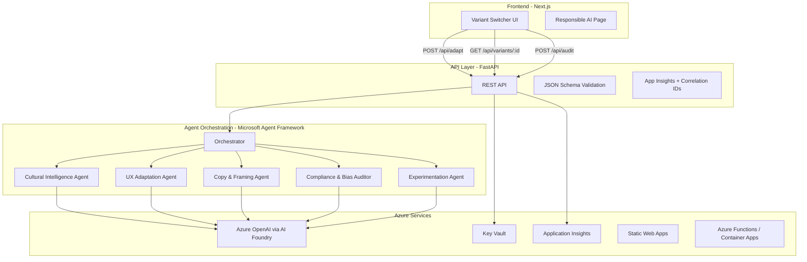

# 🌍 CultureBridge AI

> **Adapt e-commerce experiences by cultural behavior — not just language.**

[](https://github.com/YOUR_ORG/culturebridge-ai/actions/workflows/ci.yml)
[](https://github.com/YOUR_ORG/culturebridge-ai/actions/workflows/deploy.yml)
[](LICENSE)

---

## 🎯 Problem

International e-commerce loses **20-40% conversion** when expanding into new markets — not because of language, but because of **culturally misaligned decision flows and trust signals**. A checkout flow optimized for Germany (explicit specs, structured process) fails in Guatemala (relationship-first, flexible payments) and Japan (consensus cues, uncertainty reduction).

**CultureBridge AI** uses multi-agent AI orchestration to analyze cultural behavioral dimensions and generate region-adapted storefront variants with **explainable predicted conversion lift**.

---

## 🏗️ Architecture



> **[Full architecture diagram →](docs/architecture.md)**

---

## 🧠 How It Works

### Multi-Agent Orchestration (Real, Not Decorative)

| Agent | Role | Input | Output |
|-------|------|-------|--------|
| **Cultural Intelligence** | Analyze behavioral dimensions for target region | Country code + product category | `CulturalBehaviorProfile` with scored dimensions |
| **UX Adaptation** | Adapt checkout flow, modules, layout emphasis | Cultural profile + base storefront spec | Flow steps, module placement, validation rules |
| **Copy & Framing** | Reframe CTAs, microcopy, value propositions | Cultural profile + UX adaptations | Copy variants with behavioral rationale |
| **Compliance & Bias Auditor** | Check for stereotyping, require dimension-based justification | All agent outputs | Audit score, risk flags, recommended changes |
| **Experimentation** | Generate predicted lift model + A/B test plan | Complete variant spec | Predicted conversion lift with transparent assumptions |

Each agent returns **structured JSON with a `rationale` field** explaining its reasoning.

### Cultural Model (Explainable)

We use a **dimension-driven approach** — not stereotypes:

| Dimension | Effect on UX |
|-----------|-------------|
| High `uncertainty_avoidance` | More trust modules, clearer shipping/returns, fewer surprises |
| Low `context_level` | Explicit specs and pricing details shown earlier |
| High `collectivism` | Stronger social proof (reviews, community endorsements) |
| Low `friction_tolerance` | Fewer checkout steps, autofill, minimal form fields |
| High `trust_need` | Guarantees, certifications, authority signals prominent |
| High `price_sensitivity` | Value framing, comparison tools, installment options |

> **[Full cultural model documentation →](docs/cultural-model.md)**

---

## 🚀 Quick Start

### Prerequisites

- **Node.js** 18+ & **pnpm** 8+
- **Python** 3.11+
- **Azure CLI** (for deployment)
- **Azure OpenAI** resource (or AI Foundry endpoint)

### Environment Variables

```bash
# Copy and configure
cp .env.example .env
```

Required variables:
```env
AZURE_OPENAI_ENDPOINT=https://your-resource.openai.azure.com/
AZURE_OPENAI_API_KEY=your-key
AZURE_OPENAI_DEPLOYMENT=gpt-4o
AZURE_OPENAI_API_VERSION=2024-10-21
APPLICATIONINSIGHTS_CONNECTION_STRING=your-connection-string
```

### Local Development

```bash
# Install dependencies
pnpm install              # Frontend
cd apps/api && pip install -r requirements.txt  # Backend

# Run everything
pnpm dev                  # Starts Next.js on :3000
cd apps/api && uvicorn main:app --reload --port 8000  # API on :8000

# Or use Docker Compose
docker-compose up --build
```

### Run Tests

```bash
cd apps/api && python -m pytest tests/ -v
```

---

## 📦 API Reference

### `POST /api/adapt`

Generate a culturally adapted variant for a product + region.

```json
{
  "country_code": "JP",
  "product_category": "electronics",
  "price_band": "mid",
  "audience": "general_consumer",
  "override_dimensions": {
    "uncertainty_avoidance": 85
  }
}
```

### `GET /api/variants/{variant_id}`

Retrieve a previously generated variant specification.

### `POST /api/audit`

Run a compliance and bias audit on a variant.

```json
{
  "variant_id": "var_abc123"
}
```

---

## ☁️ Azure Deployment

### One-Click Deploy

```bash
# Login to Azure
az login

# Deploy infrastructure
cd infra/bicep
az deployment group create \
  --resource-group culturebridge-rg \
  --template-file main.bicep \
  --parameters @parameters.json

# Deploy via GitHub Actions (push to main)
git push origin main
```

### Infrastructure (Bicep)

| Resource | Purpose |
|----------|---------|
| Azure OpenAI | LLM inference via AI Foundry |
| Azure Functions | API hosting |
| Azure Static Web Apps | Frontend hosting |
| Key Vault | Secrets management |
| Application Insights | Observability + trace correlation |

> **[Threat model →](docs/threat-model.md)**

---

## 🎬 Demo Script (2 Minutes)

| Time | Action |
|------|--------|
| 0:00–0:20 | Show the problem: same storefront, different regions, lost conversions |
| 0:20–1:10 | Live: select product → generate JP/GT/DE variants → side-by-side comparison |
| 1:10–1:35 | Show compliance audit: score, risk flags, quick fix |
| 1:35–1:55 | Show Azure deployment + App Insights trace |
| 1:55–2:00 | Close: predicted lift summary + enterprise readiness |

> **[Full demo script →](docs/demo-script.md)**

---

## 🤖 GitHub Copilot Usage

This project was developed using **GitHub Copilot Agent Mode** in VS Code. Key areas where Copilot accelerated development:

1. **Schema Generation**: Copilot generated initial JSON Schema definitions from TypeScript interfaces, then refined with manual review for domain accuracy.
2. **Agent Prompt Engineering**: Copilot suggested system prompt structures for each agent role; we refined to ensure dimension-driven (not stereotype-driven) outputs.
3. **Bicep Templates**: Copilot generated base IaC templates; we added security hardening (managed identity, private endpoints).
4. **Test Cases**: Copilot generated test scaffolding for cultural dimension mapping rules; we added edge cases and bias detection tests.
5. **FastAPI Route Handlers**: Copilot accelerated boilerplate API code; we added correlation ID middleware and structured error handling.
6. **React Components**: Copilot assisted with the variant comparison UI; manual refinement for accessibility and responsive design.

> Copilot was used as an accelerator, not a replacement for domain expertise. All AI-generated code was reviewed for correctness, security, and bias.

---

## 👥 Team

| Name | Role | GitHub |
|------|------|--------|
| [Joshua Rosales] | Full-Stack Lead | [@handle] |
| [Jonathan] | AI/ML Engineer | [@handle] |
| [Jose Medina] | UX/Frontend | [@handle] |


---

## 📄 License

MIT — see [LICENSE](LICENSE).

---

## 🔗 Links

- [Architecture Diagram](docs/architecture.md)
- [Cultural Model Documentation](docs/cultural-model.md)
- [Responsible AI Statement](docs/responsible-ai.md)
- [Threat Model](docs/threat-model.md)
- [Demo Script](docs/demo-script.md)
- [Contributing Guide](CONTRIBUTING.md)
- [Security Policy](SECURITY.md)
