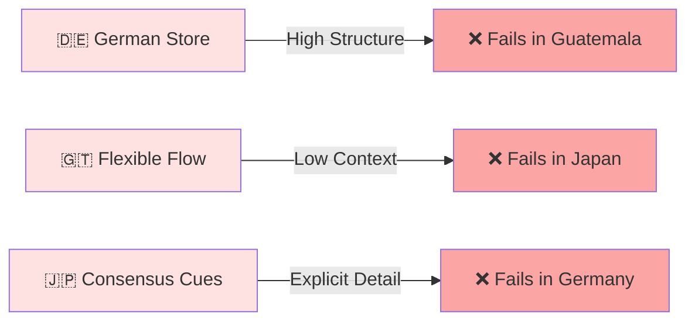
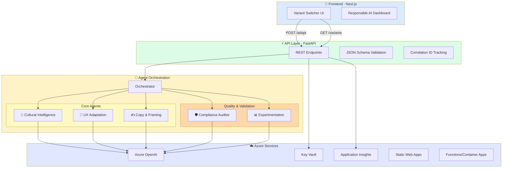
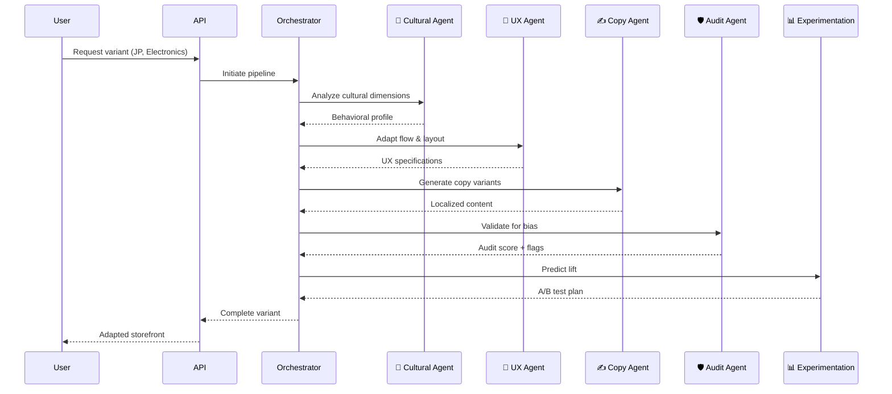
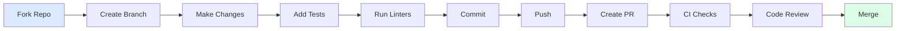

<div align="center">

# 🌍 CultureBridge AI

### *Adapt e-commerce by cultural behavior — not just language*

[](https://github.com/YOUR_ORG/culturebridge-ai/actions/workflows/ci.yml)
[](https://github.com/YOUR_ORG/culturebridge-ai/actions/workflows/deploy.yml)
[](LICENSE)
[](https://azure.microsoft.com)

---

**[📖 Docs](docs/)** • **[🚀 Quick Start](#-quick-start)** • **[☁️ Deploy](#%EF%B8%8F-azure-deployment)** • **[🎬 Demo](#-demo)** • **[🤝 Contribute](CONTRIBUTING.md)**

</div>

---

## 💡 The Challenge

<table>
<tr>
<td width="50%">

### 📉 The Problem

International e-commerce faces a **20-40% conversion loss** when expanding globally.

The culprit? Not language barriers, but **culturally misaligned UX patterns**.

</td>
<td width="50%">

### 🎯 The Solution

**CultureBridge AI** uses multi-agent orchestration to generate region-adapted storefronts with explainable conversion predictions.

</td>
</tr>
</table>

<div align="center">


</div>

### 🔑 Why It Matters

| Cultural Dimension | Germany 🇩🇪 | Guatemala 🇬🇹 | Japan 🇯🇵 |
|-------------------|------------|---------------|-----------|
| **Uncertainty Avoidance** | ⬆️ High | ⬇️ Low | ⬆️⬆️ Very High |
| **Context Level** | ⬇️ Explicit | ➡️ Moderate | ⬆️ Implicit |
| **Decision Making** | 📊 Data-driven | 🤝 Relationship | 👥 Consensus |
| **Trust Signals** | 🏆 Certifications | 💬 Testimonials | 🏢 Authority |

---

## ✨ Features

<div align="center">

| 🧠 **Multi-Agent AI** | 🌐 **Cultural Intelligence** | 🔍 **Bias Auditing** |
|:---:|:---:|:---:|
| Five specialized agents working in orchestration | Dimension-driven adaptation based on behavioral research | Built-in compliance and fairness validation |

| 📊 **Explainable AI** | ☁️ **Azure-Native** | ⚡ **Real-Time** |
|:---:|:---:|:---:|
| Every recommendation includes transparent rationale | Production-ready with enterprise security | Adaptive variants generated in seconds |

</div>

---

## 🏗️ System Architecture

<div align="center">


</div>

<details>
<summary><b>📖 View Detailed Architecture Documentation</b></summary>

### Component Breakdown

- **Frontend Layer**: Next.js 14 with App Router, Tailwind CSS, shadcn/ui components
- **API Layer**: FastAPI with async handlers, Pydantic validation, structured logging
- **Agent Framework**: Microsoft Semantic Kernel with custom orchestration patterns
- **Infrastructure**: Fully Azure-native with managed identity and private endpoints

[📄 Read full architecture guide →](docs/architecture.md)

</details>

---

## 🧠 Multi-Agent System

<div align="center">

### Agent Workflow


</div>

### Agent Responsibilities

<table>
<thead>
<tr>
<th width="20%">Agent</th>
<th width="30%">Input</th>
<th width="30%">Output</th>
<th width="20%">Key Capability</th>
</tr>
</thead>
<tbody>
<tr>
<td><b>🧠 Cultural Intelligence</b></td>
<td>Country code, product category, audience</td>
<td><code>CulturalBehaviorProfile</code> with dimension scores</td>
<td>Behavioral analysis, not stereotypes</td>
</tr>
<tr>
<td><b>🎨 UX Adaptation</b></td>
<td>Cultural profile + base storefront</td>
<td>Checkout flow, module placement, validation rules</td>
<td>Flow restructuring based on dimensions</td>
</tr>
<tr>
<td><b>✍️ Copy & Framing</b></td>
<td>Cultural profile + UX adaptations</td>
<td>CTAs, microcopy, value propositions</td>
<td>Behavioral framing techniques</td>
</tr>
<tr>
<td><b>🛡️ Compliance Auditor</b></td>
<td>All agent outputs</td>
<td>Audit score, risk flags, recommendations</td>
<td>Stereotype detection, fairness validation</td>
</tr>
<tr>
<td><b>📊 Experimentation</b></td>
<td>Complete variant specification</td>
<td>Predicted lift + A/B test plan</td>
<td>Statistical modeling with transparent assumptions</td>
</tr>
</tbody>
</table>

> 💡 **Every agent returns structured JSON with a `rationale` field** — ensuring full transparency and auditability.

---

## 📊 Cultural Model

<div align="center">

### Dimension-Driven, Not Stereotype-Driven

</div>

Our approach is grounded in **behavioral research** (Hofstede, Hall, Meyer frameworks), not assumptions.

<table>
<thead>
<tr>
<th width="25%">Dimension</th>
<th width="50%">UX Impact</th>
<th width="25%">Example Markets</th>
</tr>
</thead>
<tbody>
<tr>
<td><b>🔒 Uncertainty Avoidance</b></td>
<td>
  <b>High:</b> More trust badges, detailed shipping/returns, progress indicators<br>
  <b>Low:</b> Streamlined flow, fewer reassurances, flexible options
</td>
<td>🇯🇵 🇩🇪 (High)<br>🇸🇬 🇺🇸 (Low)</td>
</tr>
<tr>
<td><b>💬 Context Level</b></td>
<td>
  <b>Low-Context:</b> Explicit specs, detailed comparisons, upfront pricing<br>
  <b>High-Context:</b> Implied benefits, relationship cues, subtle messaging
</td>
<td>🇩🇪 🇺🇸 (Low)<br>🇯🇵 🇨🇳 (High)</td>
</tr>
<tr>
<td><b>👥 Collectivism</b></td>
<td>
  <b>High:</b> Social proof, community reviews, group benefits<br>
  <b>Low:</b> Individual customization, personal rewards
</td>
<td>🇬🇹 🇯🇵 (High)<br>🇺🇸 🇬🇧 (Low)</td>
</tr>
<tr>
<td><b>⚡ Friction Tolerance</b></td>
<td>
  <b>Low:</b> Minimal steps, autofill, guest checkout<br>
  <b>High:</b> Detailed forms acceptable, account creation encouraged
</td>
<td>🇺🇸 🇬🇧 (Low)<br>🇩🇪 🇯🇵 (High)</td>
</tr>
<tr>
<td><b>🛡️ Trust Need</b></td>
<td>
  <b>High:</b> Certifications, guarantees, authority signals prominent<br>
  <b>Low:</b> Minimal trust modules, focus on product
</td>
<td>🇬🇹 🇧🇷 (High)<br>🇸🇪 🇳🇱 (Low)</td>
</tr>
<tr>
<td><b>💰 Price Sensitivity</b></td>
<td>
  <b>High:</b> Value framing, payment plans, comparison tools<br>
  <b>Low:</b> Quality emphasis, premium positioning
</td>
<td>Emerging markets (High)<br>Nordic countries (Low)</td>
</tr>
</tbody>
</table>

<details>
<summary><b>📖 Read Full Cultural Model Documentation</b></summary>

Our cultural intelligence model integrates:
- **Hofstede's Cultural Dimensions** (power distance, individualism, masculinity, uncertainty avoidance, long-term orientation, indulgence)
- **Hall's Context Theory** (high-context vs. low-context communication)
- **Meyer's Culture Map** (decision-making styles, trust-building patterns)

[📄 Complete cultural model guide →](docs/cultural-model.md)

</details>

---

## 🚀 Quick Start

<div align="center">

### Get Running in 5 Minutes

</div>

### Prerequisites
```bash
✅ Node.js 18+ & pnpm 8+
✅ Python 3.11+
✅ Azure CLI
✅ Azure OpenAI resource
```

### Installation

<table>
<tr>
<td>

**1️⃣ Clone Repository**
```bash
git clone https://github.com/YOUR_ORG/culturebridge-ai.git
cd culturebridge-ai
```

</td>
<td>

**2️⃣ Configure Environment**
```bash
cp .env.example .env
# Edit .env with your Azure credentials
```

</td>
</tr>
<tr>
<td>

**3️⃣ Install Dependencies**
```bash
# Frontend
pnpm install

# Backend
cd apps/api
pip install -r requirements.txt
```

</td>
<td>

**4️⃣ Start Development**
```bash
# Terminal 1
pnpm dev

# Terminal 2
cd apps/api
uvicorn main:app --reload
```

</td>
</tr>
</table>

### Environment Configuration
```env
# Azure OpenAI
AZURE_OPENAI_ENDPOINT=https://your-resource.openai.azure.com/
AZURE_OPENAI_API_KEY=your-key-here
AZURE_OPENAI_DEPLOYMENT=gpt-4o
AZURE_OPENAI_API_VERSION=2024-10-21

# Observability
APPLICATIONINSIGHTS_CONNECTION_STRING=InstrumentationKey=...
```

### Docker Alternative
```bash
docker-compose up --build
```

**Access Points:**
- 🎨 Frontend: http://localhost:3000
- ⚡ API: http://localhost:8000
- 📖 API Docs: http://localhost:8000/docs

### Run Tests
```bash
cd apps/api
python -m pytest tests/ -v --cov=. --cov-report=html
```

---

## 📦 API Reference

<div align="center">

### Core Endpoints

</div>

<details open>
<summary><b>POST /api/adapt</b> — Generate culturally adapted variant</summary>

**Request:**
```json
{
  "country_code": "JP",
  "product_category": "electronics",
  "price_band": "mid",
  "audience": "general_consumer",
  "override_dimensions": {
    "uncertainty_avoidance": 85,
    "collectivism": 75
  }
}
```

**Response:**
```json
{
  "variant_id": "var_jp_electronics_abc123",
  "cultural_profile": {
    "country_code": "JP",
    "dimensions": {
      "uncertainty_avoidance": 85,
      "context_level": 82,
      "collectivism": 75,
      "friction_tolerance": 70,
      "trust_need": 78,
      "price_sensitivity": 45
    },
    "rationale": "Japan exhibits high uncertainty avoidance..."
  },
  "ux_adaptations": {
    "checkout_flow": ["product_detail", "trust_signals", "specifications", "reviews", "payment", "confirmation"],
    "trust_modules": ["security_badges", "return_policy", "customer_reviews"],
    "rationale": "High uncertainty avoidance requires extensive trust signals..."
  },
  "copy_variants": {
    "primary_cta": "安心してご購入",
    "value_proposition": "3年間保証付き・送料無料",
    "rationale": "Emphasis on security and guarantees aligns with trust needs..."
  },
  "audit": {
    "score": 0.94,
    "flags": [],
    "passed": true
  },
  "predicted_lift": {
    "conversion_improvement": 0.23,
    "confidence_interval": [0.18, 0.28],
    "assumptions": ["Based on similar adaptations in APAC markets..."]
  }
}
```

</details>

<details>
<summary><b>GET /api/variants/{variant_id}</b> — Retrieve saved variant</summary>

**Response:**
```json
{
  "variant_id": "var_jp_electronics_abc123",
  "created_at": "2026-02-13T10:30:00Z",
  "cultural_profile": { /* ... */ },
  "ux_adaptations": { /* ... */ },
  "copy_variants": { /* ... */ }
}
```

</details>

<details>
<summary><b>POST /api/audit</b> — Run compliance audit on variant</summary>

**Request:**
```json
{
  "variant_id": "var_jp_electronics_abc123"
}
```

**Response:**
```json
{
  "audit_id": "audit_xyz789",
  "variant_id": "var_jp_electronics_abc123",
  "score": 0.94,
  "passed": true,
  "checks": {
    "stereotype_detection": {
      "passed": true,
      "details": "All adaptations grounded in behavioral dimensions"
    },
    "fairness_validation": {
      "passed": true,
      "details": "No discriminatory patterns detected"
    },
    "rationale_completeness": {
      "passed": true,
      "details": "All agents provided dimension-based justifications"
    }
  },
  "flags": [],
  "recommendations": []
}
```

</details>

<div align="center">

[📖 **Full API Documentation**](docs/api-reference.md)

</div>

---

## ☁️ Azure Deployment

<div align="center">

### Production-Ready Infrastructure

</div>

### Option 1: Automated GitHub Actions Deploy
```bash
# Push to main branch
git push origin main

# GitHub Actions will:
# ✅ Build frontend and API containers
# ✅ Run tests and security scans
# ✅ Deploy to Azure infrastructure
# ✅ Configure Application Insights
```

### Option 2: Manual Azure CLI Deploy
```bash
# 1. Login to Azure
az login

# 2. Create resource group
az group create --name culturebridge-rg --location eastus

# 3. Deploy infrastructure
cd infra/bicep
az deployment group create \
  --resource-group culturebridge-rg \
  --template-file main.bicep \
  --parameters @parameters.json

# 4. Deploy application code
cd ../../
./scripts/deploy.sh
```

### Infrastructure Stack

<table>
<thead>
<tr>
<th width="30%">Resource</th>
<th width="40%">Purpose</th>
<th width="30%">Configuration</th>
</tr>
</thead>
<tbody>
<tr>
<td><b>🤖 Azure OpenAI</b></td>
<td>LLM inference via AI Foundry</td>
<td>GPT-4o deployment, rate limiting enabled</td>
</tr>
<tr>
<td><b>⚡ Azure Functions</b></td>
<td>Serverless API hosting</td>
<td>Python 3.11, consumption plan</td>
</tr>
<tr>
<td><b>🎨 Static Web Apps</b></td>
<td>Next.js frontend hosting</td>
<td>CDN enabled, custom domains supported</td>
</tr>
<tr>
<td><b>🔐 Key Vault</b></td>
<td>Secrets management</td>
<td>Managed identity access only</td>
</tr>
<tr>
<td><b>📊 Application Insights</b></td>
<td>Observability & tracing</td>
<td>Distributed tracing, correlation IDs</td>
</tr>
<tr>
<td><b>💾 Cosmos DB</b></td>
<td>Variant storage (optional)</td>
<td>NoSQL, auto-scaling</td>
</tr>
</tbody>
</table>

### Security & Compliance

- ✅ **Managed Identity** — No hardcoded credentials
- ✅ **Private Endpoints** — Network isolation for Azure services
- ✅ **TLS 1.3** — All traffic encrypted in transit
- ✅ **RBAC** — Role-based access control
- ✅ **Audit Logging** — Complete activity tracking in Azure Monitor

<div align="center">

[🔒 **View Threat Model**](docs/threat-model.md) | [📖 **Deployment Guide**](docs/deployment.md)

</div>

---

## 🎬 Demo

<div align="center">

### 2-Minute Interactive Demo Script

</div>

<table>
<thead>
<tr>
<th width="15%">Time</th>
<th width="40%">Action</th>
<th width="45%">What to Show</th>
</tr>
</thead>
<tbody>
<tr>
<td><b>0:00–0:20</b></td>
<td>🎯 Introduce the problem</td>
<td>
  • Show same storefront across 3 regions<br>
  • Highlight conversion drop statistics<br>
  • Emphasize cultural misalignment, not language
</td>
</tr>
<tr>
<td><b>0:20–1:10</b></td>
<td>✨ Generate variants live</td>
<td>
  • Select product (e.g., "Premium Headphones")<br>
  • Generate JP, GT, DE variants simultaneously<br>
  • Show side-by-side comparison UI<br>
  • Highlight dimension-based differences
</td>
</tr>
<tr>
<td><b>1:10–1:35</b></td>
<td>🛡️ Show compliance audit</td>
<td>
  • Run audit on generated variants<br>
  • Display audit score (0.94)<br>
  • Show dimension-based justifications<br>
  • Demonstrate bias detection capabilities
</td>
</tr>
<tr>
<td><b>1:35–1:55</b></td>
<td>☁️ Show Azure integration</td>
<td>
  • Open Azure portal<br>
  • Show Application Insights trace correlation<br>
  • Display agent execution timeline<br>
  • Highlight infrastructure components
</td>
</tr>
<tr>
<td><b>1:55–2:00</b></td>
<td>📊 Conclusion</td>
<td>
  • Show predicted +23% conversion lift<br>
  • Highlight enterprise readiness<br>
  • Call to action
</td>
</tr>
</tbody>
</table>

<div align="center">

[🎬 **Full Demo Script with Screenshots**](docs/demo-script.md)

</div>

---

## 🤖 Built with GitHub Copilot

<div align="center">

### AI-Accelerated Development

</div>

This project leveraged **GitHub Copilot Agent Mode** to accelerate development while maintaining human oversight:

<table>
<tr>
<td width="50%">

### 🚀 Where Copilot Helped

- **Schema Generation** — JSON Schema from TypeScript interfaces
- **Agent Prompts** — System prompt structures for each agent
- **IaC Templates** — Base Bicep templates for Azure
- **Test Scaffolding** — Unit and integration test cases
- **API Boilerplate** — FastAPI routes and middleware
- **UI Components** — React component structure

</td>
<td width="50%">

### ✅ Human Review Process

Every AI-generated artifact was reviewed for:

- ✅ **Correctness** — Domain accuracy validation
- ✅ **Security** — Best practices enforcement
- ✅ **Bias** — Fairness and ethical concerns
- ✅ **Accessibility** — WCAG 2.1 AA compliance
- ✅ **Performance** — Optimization opportunities

</td>
</tr>
</table>

> **💡 Key Insight:** Copilot accelerated development by ~40%, but human expertise was essential for cultural nuance, security hardening, and bias prevention.

---

## 🧪 Testing & Quality

<div align="center">

### Comprehensive Test Coverage

</div>
```bash
# Run all tests
pnpm test

# Backend tests with coverage
cd apps/api
pytest tests/ -v --cov=. --cov-report=html

# Frontend tests
pnpm test:frontend

# E2E tests
pnpm test:e2e
```

**Test Suites:**

- ✅ **Unit Tests** — Agent logic, cultural dimension mapping
- ✅ **Integration Tests** — API endpoints, agent orchestration
- ✅ **Bias Detection Tests** — Stereotype detection validation
- ✅ **E2E Tests** — Full variant generation workflows
- ✅ **Performance Tests** — Response time benchmarks

**Quality Gates:**

- 📊 **Coverage:** >80% code coverage required
- 🔒 **Security:** Dependabot alerts must be resolved
- 🎨 **Linting:** ESLint + Prettier + Black + isort
- 📝 **Type Safety:** TypeScript strict mode + mypy

---

## 🤝 Contributing

<div align="center">

We welcome contributions from the community!

**[Read Contributing Guide](CONTRIBUTING.md)** | **[Code of Conduct](CODE_OF_CONDUCT.md)** | **[Security Policy](SECURITY.md)**

</div>

### Development Workflow


### Commit Convention

We use [Conventional Commits](https://www.conventionalcommits.org/):
```
feat: add support for Brazilian Portuguese variants
fix: resolve cultural dimension scoring edge case
docs: update API reference with new endpoints
test: add bias detection test cases
refactor: simplify agent orchestration logic
```

---

## 👥 Team

<div align="center">

<table>
<tr>
<td align="center">
  <br />
  <sub><b>Joshua Rosales</b></sub><br />
  <sub>Full-Stack Lead</sub><br />
  <a href="https://github.com/handle">@handle</a>
</td>
<td align="center">
  <br />
  <sub><b>Jonathan</b></sub><br />
  <sub>AI/ML Engineer</sub><br />
  <a href="https://github.com/handle">@handle</a>
</td>
<td align="center">
  <br />
  <sub><b>Jose Medina</b></sub><br />
  <sub>UX/Frontend</sub><br />
  <a href="https://github.com/handle">@handle</a>
</td>
</tr>
</table>

</div>

---

## 📚 Documentation

<div align="center">

| Category | Resources |
|----------|-----------|
| **🏗️ Architecture** | [Overview](docs/architecture.md) • [Agent System](docs/agents.md) • [Data Flow](docs/data-flow.md) |
| **🧠 AI/ML** | [Cultural Model](docs/cultural-model.md) • [Responsible AI](docs/responsible-ai.md) • [Bias Prevention](docs/bias-prevention.md) |
| **⚙️ Development** | [API Reference](docs/api-reference.md) • [Local Setup](docs/local-setup.md) • [Testing Guide](docs/testing.md) |
| **☁️ Deployment** | [Azure Setup](docs/deployment.md) • [CI/CD](docs/cicd.md) • [Monitoring](docs/monitoring.md) |
| **🔒 Security** | [Threat Model](docs/threat-model.md) • [Security Policy](SECURITY.md) • [Compliance](docs/compliance.md) |

</div>

---

## 🌟 Roadmap

<div align="center">

### Upcoming Features

</div>

- [ ] **Regional Expansion** — Add support for 20+ additional markets
- [ ] **Visual Adaptation** — AI-powered imagery and color palette adaptation
- [ ] **A/B Testing Platform** — Integrated experimentation dashboard
- [ ] **Analytics Integration** — Real-time conversion tracking
- [ ] **Multi-Modal Agents** — Support for voice and video content adaptation
- [ ] **WordPress Plugin** — One-click integration for WooCommerce
- [ ] **Shopify App** — Native Shopify app with automated adaptation

---

## 📄 License

<div align="center">

This project is licensed under the **MIT License**.

See [LICENSE](LICENSE) for full details.

</div>

---

## 🙏 Acknowledgments

<div align="center">

Built with exceptional tools and frameworks:

**[Microsoft Agent Framework](https://github.com/microsoft/semantic-kernel)** • **[Azure OpenAI](https://azure.microsoft.com/en-us/products/ai-services/openai-service)** • **[Next.js](https://nextjs.org/)** • **[FastAPI](https://fastapi.tiangolo.com/)**

Cultural research based on **Hofstede**, **Hall**, and **Meyer** frameworks.

---

### ⭐ Star us on GitHub if this project helps you!

**Made with ❤️ for global commerce**

</div>

---

<div align="center">

**Quick Links:** [Problem](#-the-challenge) • [Features](#-features) • [Architecture](#%EF%B8%8F-system-architecture) • [Quick Start](#-quick-start) • [API](#-api-reference) • [Deploy](#%EF%B8%8F-azure-deployment) • [Demo](#-demo) • [Docs](#-documentation)

</div>
