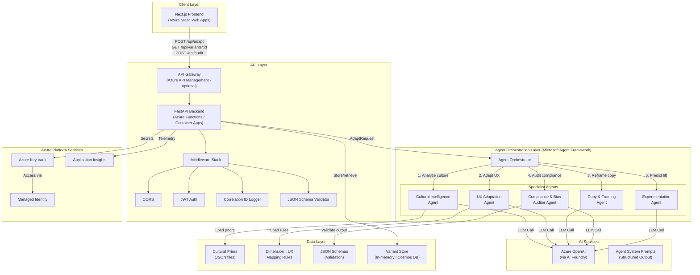
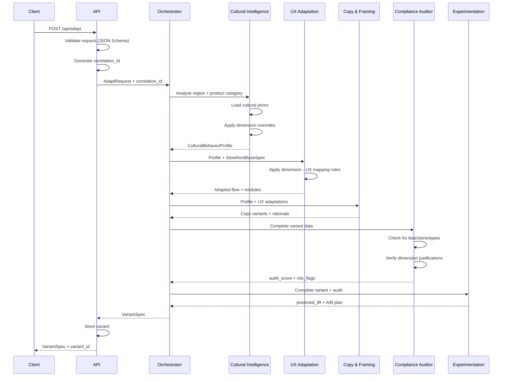

# Architecture

## System Overview

CultureBridge AI is a multi-agent system that adapts e-commerce storefront experiences based on cultural behavioral dimensions. The system uses Microsoft Agent Framework for orchestration and Azure AI Foundry / Azure OpenAI for inference.

## Architecture Diagram



## Agent Pipeline Flow



## Component Details

### Frontend (Next.js)
- **Variant Switcher**: Side-by-side comparison of base vs adapted variants
- **Dimension Overrides**: Slider controls for manual dimension adjustment
- **Audit Dashboard**: Visual display of compliance scores and risk flags
- **Responsible AI Page**: Transparency, limitations, human-in-the-loop controls

### API Layer (FastAPI)
- **REST Endpoints**: `/api/adapt`, `/api/variants/:id`, `/api/audit`
- **JSON Schema Validation**: All inputs/outputs validated against schemas
- **Correlation IDs**: Every request gets a unique trace ID
- **Error Handling**: Safe defaults, structured error responses

### Agent Orchestrator
- **Sequential Pipeline**: Cultural → UX → Copy → Compliance → Experimentation
- **Structured Output**: Each agent returns JSON with `rationale` field
- **Tool Calls**: Agents can invoke cultural priors and mapping rules as tools

### Azure Services
- **Azure OpenAI**: GPT-4o for agent inference
- **Key Vault**: Secrets management with Managed Identity access
- **Application Insights**: Distributed tracing with correlation IDs
- **Static Web Apps**: Frontend hosting with CI/CD

## Generating Architecture Diagram as PNG

To export the Mermaid diagram as PNG:

1. **VS Code**: Install "Markdown Preview Mermaid Support" extension
2. **CLI**: Use `mmdc` (Mermaid CLI):
   ```bash
   npm install -g @mermaid-js/mermaid-cli
   mmdc -i docs/architecture.md -o docs/architecture.png -t dark
   ```
3. **Online**: Paste the Mermaid code at [mermaid.live](https://mermaid.live)
